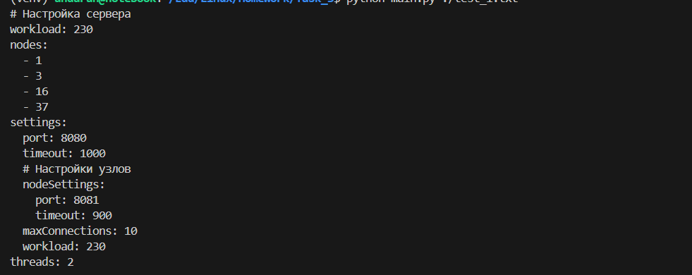

# Домашние задания по конфигурационному управлению
## Новиков Андрей ИКБО-40-23

## Общие этапы сборки проектов репозитория
1. Загрузить репозиторий на компьютер 
```bash 
git clone https://github.com/andaran/Configuration_management
cd Configuration_management
```
2. Создать в корне репозитория виртуальную среду python и активировать её.
```bash
python3 -m venv venv
source venv/bin/activate
```

## Задание 3

### Описание
Инструмент командной строки для учебного конфигурационного
языка. Этот инструмент преобразует текст из
входного формата в выходной. Синтаксические ошибки выявляются с выдачей
сообщений. 

### Функции
- Трансляция конфигурационного языка в yaml;
- Вычисление константных выражений;
- Вывод ошибок в удобном формате.

### Старт проекта
Открыть директорию Task_3 и запустить main.py с передачей аргументом файла с кодом
```bash
cd Task_3
python main.py ./test_1.txt
```

### Пример использования
Для входного файла test_1.txt:
```
! Настройка сервера
workload: 230
nodes: [1 3 16 37]
settings: {
    port = 8080
    timeout = 1000
    ! Настройки узлов
    nodeSettings = {
        port = 8081
        timeout = 900
    }
    maxConnections = 10
    workload = 230
}
threads: 2
```


Для входного файла test_2.txt:
```
! Постфиксные выражения
x: 1
y: 2
z: ^(x y +)
k: ^(x y z + +)
res: ^(z k + sqrt)
! res: 3.0
```


### Результаты тестирования


## Задание 2

### Описание
Инструмент командной строки для визуализации графа зависимостей, включая транзитивные зависимости  для файла-пакета платформы .NET (nupkg). Рядом с программой находится файл config.yaml, в котором указаны путь к программе для визуализации графов, путь к анализируемому пакету и URL-адрес репозитория.

### Функции
- Отображение прямых зависимостей пакета;
- Рекурсивное отображение транзитивных зависимостей пакета.

### Старт проекта
Открыть директорию Task_2, установить необходимые библиотеки и запустить main.py
```bash
cd Task_2
pip install requests yaml
python main.py
```

### Пример использования


### Результаты тестирования


## Задание 1

### Описание
Эмулятор для языка оболочки ОС, похож на сеанс bash в Linux. Имеет свой GUI. Рядом с программой находится файл config.csv, в котором указаны путь до стартового скрипта и .tar архив с файловой системой.

### Функции
- Эмуляция команд: ls, cd, exit, tail, du;
- Исполнение стартового скрипта при запуске эмулятора.

### Старт проекта
Открыть директорию Task_1 и запустить main.py
```bash
cd Task_1
python main.py
```

### Пример использования


### Результаты тестирования
